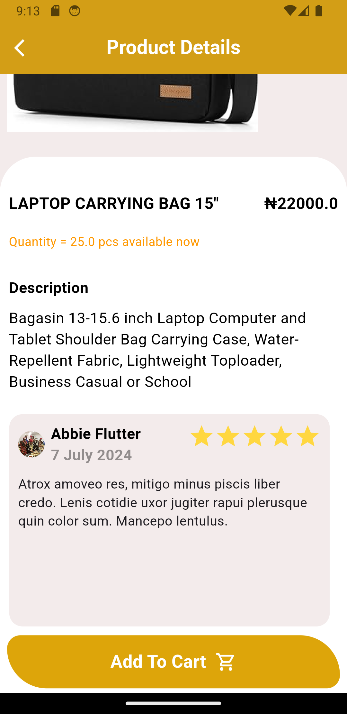
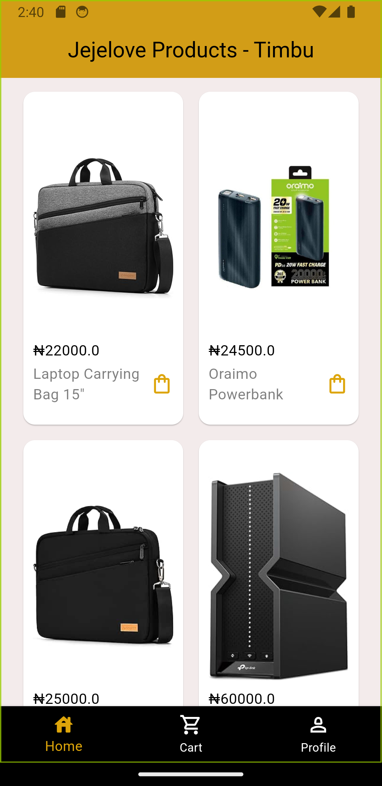
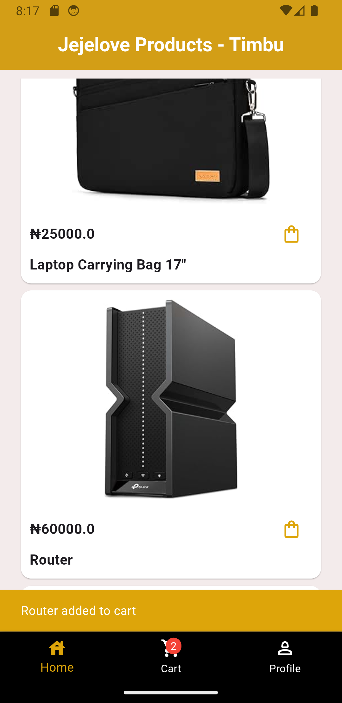
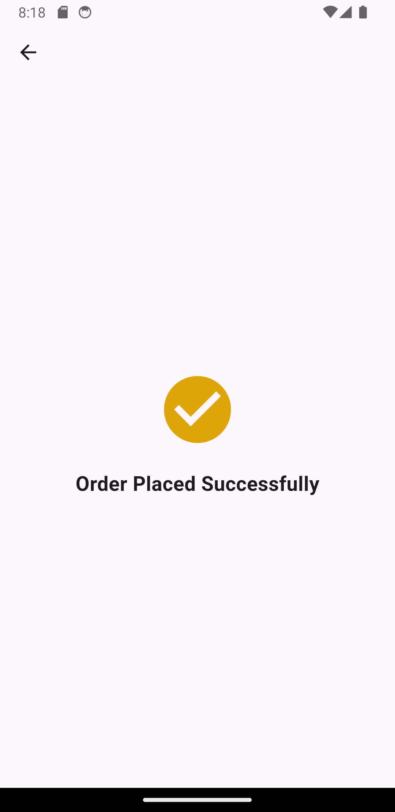

# fjeje_timbu
<p align="left">  </p>

A Flutter project for HNG 11 Satage 3 promo mobile task.
The problem was to build an app that makes use of the [Timbu Api](https://api.timbu.com)
 to fetch 10 products. Products should have a view/details. This Flutter application allows users to browse and add products to their cart, interacting with the Timbu API to fetch and display product information.

# Images Preview
<table>
  <tr>
    <td>SplashScreen</td>
     <td>Home Products listview</td>
     <td>Dynamic Carousel Reviews</td>
  </tr>
  <tr>
    <td></td>
    <td></td>
    <td></td>
  </tr>
 </table>
 
  I started with this,
<table>
  <tr>
    <td>Former gridview</td>
     <td>Current ListView of Product</td>
     <td>Confirmation Page</td>
  </tr>
  <tr>
    <td></td>
    <td></td>
    <td></td>
  </tr>
 </table>


# Table of Contents

* [Introduction](#fjeje_timbu)
* [Images/Preview](#images-preview)
* [Table of Content](#Table-of-content)
* [Getting Started](#getting-started)
* [File Structure](#file-structure)
* [Features](#features)
* [Installation](#installation)
* [App Routing/structure](#app-routing-structure)
* [Social Media](#social-media)
* 
# Getting Started
For help getting started with Flutter development, view the
[online documentation](https://docs.flutter.dev/), which offers tutorials,
samples, guidance on mobile development, and a full API reference.


# Features

- Browse Products: View a list of available products from the Timbu API.
- Product Details: Click on a product to view more details.
- Add to Cart: Add products to your cart with a single click.
- User Notifications: Receive notifications when products are added to the cart.
- A bottom navigation bar with 3 routes/tabs
- Slider carousel for the product details review
- Clean UI and StateManagement

# Installation

This application uses the Timbu API to fetch product information. Ensure you have the correct API endpoint and necessary permissions to access the data.

- API Endpoint: https://api.timbu.cloud
- Fetching Products: Products are fetched using the getProduct method from the TimbuApiProvider.
- Clone the repo: `git clone https://github.com/jGraphics/fjeje-timbu.git`
- cd fjeje-timbu.
- Install dependencies: Make sure you have Flutter installed. Then run:  `flutter pub get`
- To run the app:  `flutter run`

To download apk, click <a href="https://drive.google.com/drive/folders/1HuJf-TPLKT6VWD8BygloYgl77BSsKiLt?usp=drive_link"> here </a>

# File structure

```
lib/
│
├── api/
│   ├── connectionUrl/
│   │   ├── apiUrl.dart
│   ├── models/
│   │   ├── currentPrice.dart
│   │   ├── listOfPhotos.dart
│   │   ├── listOfProductItem.dart
│   │   ├── mainListProduct.dart
│   ├── timbu_api.dart
│
│
├── constants/
│   ├── colors.dart
│   ├── bNav.dart
│   ├── onboardData.dart
│
├── model/
│   ├── messageRes.dart
│   ├── productModel.dart
├── screens/
│   ├── onboarding_screen.dart
│   ├── onboarding_page.dart
│   ├── BottomNavigation.dart
│   ├── checkoutScreen.dart
│   ├── cartScreen.dart
│   ├── profileScreen.dart
│   ├── viewProduct.dart
│   ├── Splashcreen.dart
│ 
├── widgets/
│   ├── reviewSlider.dart
│
└── main.dart

```
# App Routing structure

```
Splashscreen/
│
├── Onboarding
│   ├── slide1/
│   ├── slide2/
│   ├── slide3/
│   
│   ├── BNav/
│   │   ├── Products Screen
│   │   ├── Cart Screen
│   │   ├── Profile Screen(Not fully implemented yet)
│  
│
```


# Social Media

Twitter: <https://twitter.com/drpearlz>

Facebook: <https://www.facebook.com/peggicherrie>
